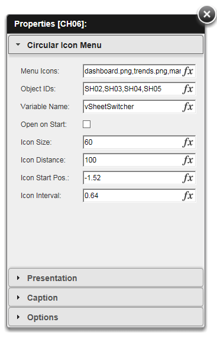

QlikView Extension CircularIconMenu
===================================

Extension implementing a circular icon menu based on WCircleMenu http://danartinho.github.io/WCircleMenu by https://github.com/danartinho

The extension sets an QlikView Object ID into a QlikView Document Variable on icon click. This can be used to switch layout objects via variable triggers for more fancy navgations.

Properties:
-----------
1. Menu Items : Comma separated list of images to use for pop-out icons. Middle icon (turning wheel) is always displayed from image ./img/plus.png, place own images into the extension sub-folder ./img
2. Object IDs : Corresponding comma separated QlikView Object ID list to use in trigger (in this case Sheet IDs)
3. Variable Name : QlikView variable (defined in document) to use to set the Object ID on icon click
4. Open on Start : check if icon menu should start in open mode (pop-out)

Inspired by first implementation attempt here: https://github.com/hvus/Qlikview-Object-WCircleMenu

Example icon used from: https://www.elegantthemes.com/blog/freebie-of-the-week/beautiful-flat-icons-for-free